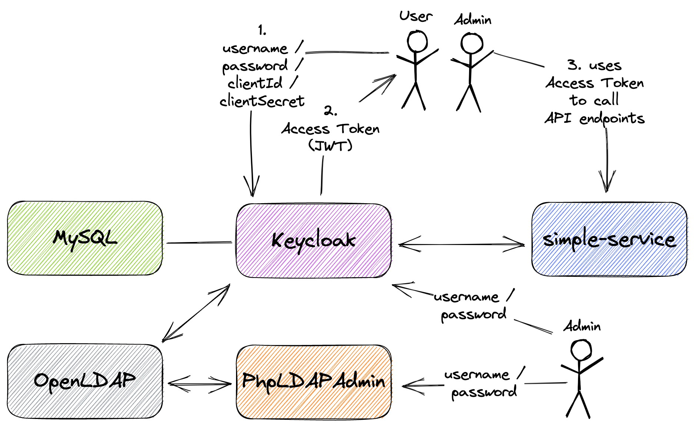
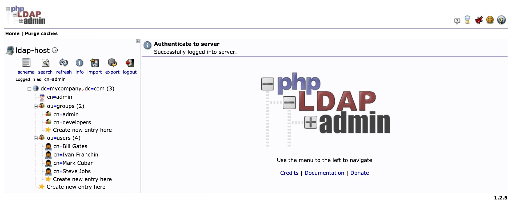
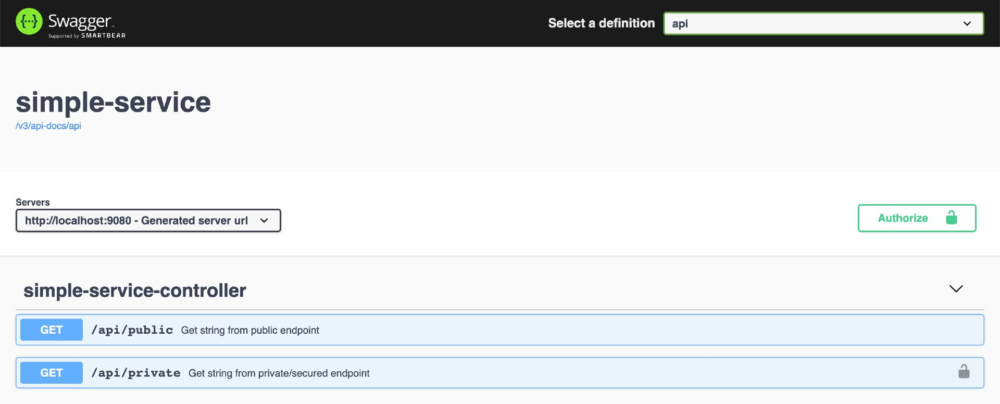

# springboot-keycloak-openldap

The goal of this project is to create a simple [Spring Boot](https://docs.spring.io/spring-boot/docs/current/reference/htmlsingle/) REST API, called `simple-service`, and secure it with [`Keycloak`](https://www.keycloak.org). Furthermore, the API users will be loaded into `Keycloak` from [`OpenLDAP`](https://www.openldap.org) server.

> **Note**: In [`springboot-react-keycloak`](https://github.com/ivangfr/springboot-react-keycloak) repository, we have implemented a `movies-app` using `Keycloak` (with `PKCE`). This application consists of two services: the backend that was implemented using `Spring Boot` and the frontend implemented with `ReactJS`.

## Proof-of-Concepts & Articles

On [ivangfr.github.io](https://ivangfr.github.io), I have compiled my Proof-of-Concepts (PoCs) and articles. You can easily search for the technology you are interested in by using the filter. Who knows, perhaps I have already implemented a PoC or written an article about what you are looking for.

## Additional Readings

- \[**Medium**\] [**Implementing and Securing a Simple Spring Boot REST API with Keycloak**](https://medium.com/@ivangfr/how-to-secure-a-spring-boot-app-with-keycloak-5a931ee12c5a)
- \[**Medium**\] [**Implementing and Securing a Simple Spring Boot UI (Thymeleaf + RBAC) with Keycloak**](https://medium.com/spring-boot/how-to-secure-a-simple-spring-boot-ui-thymeleaf-rbac-with-keycloak-ba9f30b9cb2b)
- \[**Medium**\] [**Implementing and Securing a Spring Boot GraphQL API with Keycloak**](https://medium.com/javarevisited/implementing-and-securing-a-spring-boot-graphql-api-with-keycloak-c461c86e3972)
- \[**Medium**\] [**Setting Up OpenLDAP With Keycloak For User Federation**](https://medium.com/@ivangfr/setting-up-openldap-with-keycloak-for-user-federation-82c643b3a0e6)
- \[**Medium**\] [**Integrating GitHub as a Social Identity Provider in Keycloak**](https://medium.com/@ivangfr/integrating-github-as-a-social-identity-provider-in-keycloak-982f521a622f)
- \[**Medium**\] [**Integrating Google as a Social Identity Provider in Keycloak**](https://medium.com/@ivangfr/integrating-google-as-a-social-identity-provider-in-keycloak-c905577ec499)
- \[**Medium**\] [**Building a Single Spring Boot App with Keycloak or Okta as IdP: Introduction**](https://medium.com/@ivangfr/building-a-single-spring-boot-app-with-keycloak-or-okta-as-idp-introduction-2814a4829aed)
- \[**Medium**\] [**Implementing a Full Stack Web App using Spring-Boot and React**](https://medium.com/javarevisited/implementing-a-full-stack-web-app-using-spring-boot-and-react-7db598df4452)
- \[**Medium**\] [**Using Keycloak to secure a Full Stack Web App implemented with Spring-Boot and React**](https://medium.com/javarevisited/using-keycloak-to-secure-a-full-stack-web-app-implemented-with-spring-boot-and-react-6b2d80fc5c12)

## Project Diagram



## Application

- ### simple-service

  `Spring Boot` Web Java application that exposes the following endpoints:
  - `GET /api/public`: it's a not secured endpoint, everybody can access it;
  - `GET /api/private`: it's a secured endpoint, only accessible by users that provide a `JWT` access token issued by `Keycloak` and the token must contain the role `USER`;
  - `GET /actuator/*`: they are not secured endpoint, used to expose operational information about the application.

## Prerequisites

- [`Java 17+`](https://www.oracle.com/java/technologies/downloads/#java17)
- [`Docker`](https://www.docker.com/)
- [`jq`](https://stedolan.github.io/jq)

## Start Environment

- Open a terminal and inside `springboot-keycloak-openldap` root folder run
  ```
  docker compose up -d
  ```

- Wait for Docker containers to be up and running. To check it, run
  ```
  docker compose ps
  ```

## Import OpenLDAP Users

The `LDIF` file that we will use, `springboot-keycloak-openldap/ldap/ldap-mycompany-com.ldif`, contains a pre-defined structure for `mycompany.com`. Basically, it has 2 groups (`developers` and `admin`) and 4 users (`Bill Gates`, `Steve Jobs`, `Mark Cuban` and `Ivan Franchin`). Besides, it's defined that `Bill Gates`, `Steve Jobs` and `Mark Cuban` belong to `developers` group and `Ivan Franchin` belongs to `admin` group.
```
Bill Gates > username: bgates, password: 123
Steve Jobs > username: sjobs, password: 123
Mark Cuban > username: mcuban, password: 123
Ivan Franchin > username: ifranchin, password: 123
```

There are two ways to import those users: running a script or using `phpldapadmin` website

### Running a script

- In a terminal and inside `springboot-keycloak-openldap` root folder run
  ```
  ./import-openldap-users.sh
  ```

- The command below can be used to check the users imported
  ```
  ldapsearch -x -D "cn=admin,dc=mycompany,dc=com" \
    -w admin -H ldap://localhost:389 \
    -b "ou=users,dc=mycompany,dc=com" \
    -s sub "(uid=*)"
  ```

### Using phpldapadmin website

- Access https://localhost:6443

- Login with the credentials
  ```
  Login DN: cn=admin,dc=mycompany,dc=com
  Password: admin
  ```

- Import the file `springboot-keycloak-openldap/ldap/ldap-mycompany-com.ldif`

- You should see a tree like the one shown in the picture below

  

## Configure Keycloak

There are two ways: running a script or using `Keycloak` website

### Running a script

- In a terminal, make sure you are inside `springboot-keycloak-openldap` root folder

- Run the script below to configure `Keycloak` for `simple-service` application
  ```
  ./init-keycloak.sh
  ```

  It creates `company-services` realm, `simple-service` client, `USER` client role, `ldap` federation and the users `bgates` and `sjobs` with the role `USER` assigned.

- Copy `SIMPLE_SERVICE_CLIENT_SECRET` value that is shown at the end of the script. It will be needed whenever we call `Keycloak` to get a `JWT` access token to access `simple-service`

### Using Keycloak website

Please, have a look at this **Medium** article, [**Setting Up OpenLDAP With Keycloak For User Federation**](https://medium.com/@ivangfr/setting-up-openldap-with-keycloak-for-user-federation-82c643b3a0e6)

## Run simple-service using Maven

- Open a new terminal and make sure you are in `springboot-keycloak-openldap` root folder

- Start the application by running the following command
  ```
  ./mvnw clean spring-boot:run --projects simple-service -Dspring-boot.run.jvmArguments="-Dserver.port=9080"
  ```

## Test using curl

1. Open a new terminal

2. Call the endpoint `GET /api/public`
   ```
   curl -i http://localhost:9080/api/public
   ```
   
   It should return
   ```
   HTTP/1.1 200
   It is public.
   ```
   
3. Try to call the endpoint `GET /api/private` without authentication
   ```
   curl -i http://localhost:9080/api/private
   ```
   
   It should return
   ```
   HTTP/1.1 401
   ```

4. Create an environment variable that contains the `Client Secret` generated by `Keycloak` to `simple-service` at [Configure Keycloak](#configure-keycloak) step
   ```
   SIMPLE_SERVICE_CLIENT_SECRET=...
   ```

5. Run the command below to get an access token for `bgates` user
   ```
   BGATES_ACCESS_TOKEN=$(curl -s -X POST \
     "http://localhost:8080/realms/company-services/protocol/openid-connect/token" \
     -H "Content-Type: application/x-www-form-urlencoded" \
     -d "username=bgates" \
     -d "password=123" \
     -d "grant_type=password" \
     -d "client_secret=$SIMPLE_SERVICE_CLIENT_SECRET" \
     -d "client_id=simple-service" | jq -r .access_token)
   ```
   > **Note**: In [jwt.io](https://jwt.io), you can decode and verify the `JWT` access token

6. Call the endpoint `GET /api/private`
   ```
   curl -i http://localhost:9080/api/private -H "Authorization: Bearer $BGATES_ACCESS_TOKEN"
   ```
   
   It should return
   ```
   HTTP/1.1 200
   bgates, it is private.
   ```

7. Run the command below to get an access token for `mcuban` user
   ```
   MCUBAN_ACCESS_TOKEN=$(curl -s -X POST \
     "http://localhost:8080/realms/company-services/protocol/openid-connect/token" \
     -H "Content-Type: application/x-www-form-urlencoded" \
     -d "username=mcuban" \
     -d "password=123" \
     -d "grant_type=password" \
     -d "client_secret=$SIMPLE_SERVICE_CLIENT_SECRET" \
     -d "client_id=simple-service" | jq -r .access_token)
   ```

8. Try to call the endpoint `GET /api/private`
   ```
   curl -i http://localhost:9080/api/private -H "Authorization: Bearer $MCUBAN_ACCESS_TOKEN"
   ```
   As `mcuban` does not have the `USER` role assigned, he cannot access this endpoint.
   
   The endpoint return should be
   ```
   HTTP/1.1 403
   WWW-Authenticate: Bearer error="insufficient_scope", error_description="The request requires higher privileges than provided by the access token.", error_uri="https://tools.ietf.org/html/rfc6750#section-3.1"
   ```

9. Go to `Keycloak` and add the role `USER` to the `mcuban`

10. Run the command mentioned in `step 7)` again to get a new access token for `mcuban` user

11. Call again the endpoint `GET /api/private` using the `curl` command presented in `step 8`

    It should return
    ```
    HTTP/1.1 200
    mcuban, it is private.
    ```

12. The access token default expiration period is `5 minutes`. So, wait for this time and, using the same access token, try to call the private endpoint.

    It should return
    ```
    HTTP/1.1 401
    WWW-Authenticate: Bearer realm="company-services", error="invalid_token", error_description="Token is not active"
    ```

## Test using Swagger

1. Access http://localhost:9080/swagger-ui.html

   

2. Click `GET /api/public` to open it. Then, click `Try it out` button and, finally, click `Execute` button

   It should return
   ```
   Code: 200
   Response Body: It is public.
   ```

3. Now click `GET /api/private` secured endpoint. Let's try it without authentication. Then, click `Try it out` button and, finally, click `Execute` button
  
   It should return
   ```
   Code: 401
   Details: Error: response status is 401
   ```

4. In order to access the private endpoint, you need an access token. So, open a terminal

5. Create an environment variable that contains the `Client Secret` generated by `Keycloak` to `simple-service` at [Configure Keycloak](#configure-keycloak) step
   ```
   SIMPLE_SERVICE_CLIENT_SECRET=...
   ```
  
6. Run the following commands
   ```
   BGATES_ACCESS_TOKEN=$(curl -s -X POST \
     "http://localhost:8080/realms/company-services/protocol/openid-connect/token" \
     -H "Content-Type: application/x-www-form-urlencoded" \
     -d "username=bgates" \
     -d "password=123" \
     -d "grant_type=password" \
     -d "client_secret=$SIMPLE_SERVICE_CLIENT_SECRET" \
     -d "client_id=simple-service" | jq -r .access_token)
     
   echo $BGATES_ACCESS_TOKEN
   ```

7. Copy the token generated and go back to `Swagger`

8. Click `Authorize` button and paste the access token in the `Value` field. Then, click `Authorize` button and, to finalize, click `Close`

9. Go to `GET /api/private` and call this endpoint again, now with authentication

   It should return
   ```
   Code: 200
   Response Body: bgates, it is private.
   ```

## Using client_id and client_secret to get access token

You can get an access token to `simple-service` using `client_id` and `client_secret`

### Configuration

- Access http://localhost:8080/admin/
- Select `company-services` realm (if it's not already selected)
- On the left menu, click `Clients`
- Select `simple-service` client
- In `Settings` tab
  - Go to `Capability config` and check `Service accounts roles` checkbox
  - Click `Save` button
- In `Service account roles` tab
  - Click `service-account-simple-service` link present in the info message
    > "To manage detail and group mappings, click on the username service-account-simple-service"
  - In `Role mapping` tab
    - Click `Assign role` button
    - Click `Filter by realm roles` dropdown button and select `Filter by clients`
    - In `Search by role name` type `simple-service` and press `Enter`
    - Select `USER` role of the `simple-service` and click `Assign` button
    - Now, `service-account-simple-service` has the role `USER` of `simple-service` assigned

### Test

1. Open a terminal

2. Create an environment variable that contains the `Client Secret` generated by `Keycloak` to `simple-service` at [Configure Keycloak](#configure-keycloak) step
   ```
   SIMPLE_SERVICE_CLIENT_SECRET=...
   ```
  
3. Run the following command
   ```
   CLIENT_ACCESS_TOKEN=$(curl -s -X POST \
     "http://localhost:8080/realms/company-services/protocol/openid-connect/token" \
     -H "Content-Type: application/x-www-form-urlencoded" \
     -d "grant_type=client_credentials" \
     -d "client_secret=$SIMPLE_SERVICE_CLIENT_SECRET" \
     -d "client_id=simple-service" | jq -r .access_token)
   ```
  
4. Try to call the endpoint `GET /api/private`
   ```
   curl -i http://localhost:9080/api/private -H "Authorization: Bearer $CLIENT_ACCESS_TOKEN"
   ```
  
   It should return
   ```
   HTTP/1.1 200
   service-account-simple-service, it is private.
   ```

## Running simple-service as a Docker container

- In a terminal, make sure you are in `springboot-keycloak-openldap` root folder

- Build Docker Image
  - JVM
    ```
    ./docker-build.sh
    ```
  - Native
    ```
    ./docker-build.sh native
    ```
  
  | Environment Variable | Description                                                 |
  |----------------------|-------------------------------------------------------------|
  | `KEYCLOAK_HOST`      | Specify host of the `Keycloak` to use (default `localhost`) |
  | `KEYCLOAK_PORT`      | Specify port of the `Keycloak` to use (default `8080`)      |

- Run Docker Container
  ```
  docker run --rm --name simple-service \
    -p 9080:8080 \
    -e KEYCLOAK_HOST=keycloak \
    --network=springboot-keycloak-openldap_default \
    ivanfranchin/simple-service:1.0.0
  ```

- Open a new terminal

- Create an environment variable that contains the `Client Secret` generated by `Keycloak` to `simple-service` at [Configure Keycloak](#configure-keycloak) step
  ```
  SIMPLE_SERVICE_CLIENT_SECRET=...
  ```

- Run the commands below to get an access token for `bgates` user
  ```
  BGATES_TOKEN=$(
    docker run -t --rm --network springboot-keycloak-openldap_default alpine/curl:latest sh -c '
      curl -s -X POST http://keycloak:8080/realms/company-services/protocol/openid-connect/token \
        -H "Content-Type: application/x-www-form-urlencoded" \
        -d "username=bgates" \
        -d "password=123" \
        -d "grant_type=password" \
        -d "client_secret='$SIMPLE_SERVICE_CLIENT_SECRET'" \
        -d "client_id=simple-service"')
  
  BGATES_ACCESS_TOKEN=$(echo $BGATES_TOKEN | jq -r .access_token)
  ```

- Call the endpoint `GET /api/private`
  ```
  curl -i http://localhost:9080/api/private -H "Authorization: Bearer $BGATES_ACCESS_TOKEN"
  ```

## Shutdown

- To stop `simple-service` application, go to the terminal where it is running and press `Ctrl+C`
- To stop and remove docker compose containers, network and volumes, go to a terminal and inside `springboot-keycloak-openldap` root folder, run the following command
  ```
  docker compose down -v
  ```

## Cleanup

To remove the Docker image create by this project, go to a terminal and, inside `springboot-keycloak-openldap` root folder, run the following script
```
./remove-docker-images.sh
```

## References

- https://www.keycloak.org/docs/latest/server_admin/
