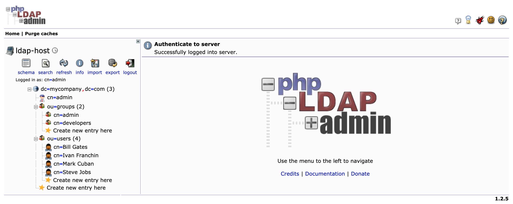
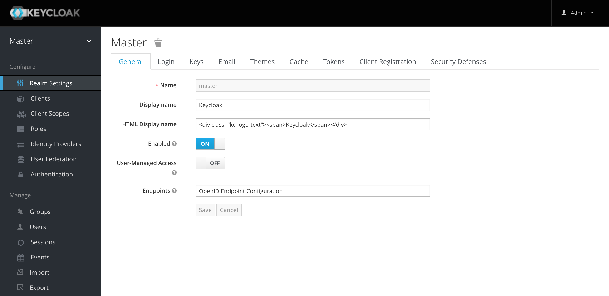

# springboot-keycloak-openldap

The goal of this project is to create a simple [Spring Boot](https://docs.spring.io/spring-boot/docs/current/reference/htmlsingle/) REST API, called `simple-service`, and secure it with [`Keycloak`](https://www.keycloak.org). Furthermore, the API users will be loaded into `Keycloak` from [`OpenLDAP`](https://www.openldap.org) server.

> **Note 1:** In [`springboot-react-keycloak`](https://github.com/ivangfr/springboot-react-keycloak) repository, we have implemented a `movies-app` using `Keycloak` (with `PKCE`). This application consists of two services: the backend that was implemented using `Spring Boot` and the frontend implemented with `ReactJS`.

> **Note 2:** In [`docker-swarm-environment`](https://github.com/ivangfr/docker-swarm-environment) repository, it's shown how to deploy this project into a cluster of Docker Engines in swarm mode. Besides, we will be running a Keycloak cluster with more than one instance.

## Application

- ### simple-service

  `Spring Boot` Web Java application that exposes two endpoints:
  
  - `/api/public`: endpoint that can be access by anyone, it is not secured;
  - `/api/private`: endpoint that can just be accessed by users that provide a `JWT` token issued by `Keycloak` and the token must contain the role `USER`.

## Prerequisites

- [`Java 11+`](https://www.oracle.com/java/technologies/javase-jdk11-downloads.html)
- [`Docker`](https://www.docker.com/)
- [`Docker-Compose`](https://docs.docker.com/compose/install/)
- [`jq`](https://stedolan.github.io/jq)

## Start Environment

- Open a terminal and inside `springboot-keycloak-openldap` root folder run
  ```
  docker-compose up -d
  ```

- Wait until `MySQL` and `Keycloak` containers are `Up (healthy)`. In order to check it run
  ```
  docker-compose ps
  ```

## Import OpenLDAP Users

The `LDIF` file that we will use, `springboot-keycloak-openldap/ldap/ldap-mycompany-com.ldif`, contains a pre-defined structure for `mycompany.com`. Basically, it has 2 groups (`developers` and `admin`) and 4 users (`Bill Gates`, `Steve Jobs`, `Mark Cuban` and `Ivan Franchin`). Besides, it's defined that `Bill Gates`, `Steve Jobs` and `Mark Cuban` belong to `developers` group and `Ivan Franchin` belongs to `admin` group.
```
Bill Gates > username: bgates, password: 123
Steve Jobs > username: sjobs, password: 123
Mark Cuban > username: mcuban, password: 123
Ivan Franchin > username: ifranchin, password: 123
```

There are two ways to import those users: running a script or using `phpldapadmin` website

### Running a script

In a terminal and inside `springboot-keycloak-openldap` root folder run
```
./import-openldap-users.sh
```

### Using phpldapadmin website

- Access https://localhost:6443

- Login with the credentials
  ```
  Login DN: cn=admin,dc=mycompany,dc=com
  Password: admin
  ```

- Import the file `springboot-keycloak-openldap/ldap/ldap-mycompany-com.ldif`

- You should see a tree like the one shown in the picture below

  

## Configure Keycloak

There are two ways: running a script or using `Keycloak` website

### Running a script

- In a terminal, make sure you are inside `springboot-keycloak-openldap` root folder

- Run the script below to configure `Keycloak` for `simple-service` application
  ```
  ./init-keycloak.sh
  ```

  It creates `company-services` realm, `simple-service` client, `USER` client role, `ldap` federation and the users `bgates` and `sjobs` with the role `USER` assigned.

- Copy `SIMPLE_SERVICE_CLIENT_SECRET` value that is shown at the end of the script. It will be needed whenever we call `Keycloak` to get a token to access `simple-service`

### Using Keycloak website



#### Login

- Access http://localhost:8080/auth/admin/

- Login with the credentials
  ```
  Username: admin
  Password: admin
  ```

#### Create a new Realm

- Go to top-left corner and hover the mouse over `Master` realm. Click the `Add realm` blue button that will appear
- Set `company-services` to the `Name` field and click `Create` button

#### Create a new Client

- On the left menu, click `Clients` 
- Click `Create` button
- Set `simple-service` to `Client ID` and click `Save` button
- In `Settings` tab
  - Set `confidential` to `Access Type`
  - Set `http://localhost:9080` to `Valid Redirect URIs`
  - Click `Save` button
- In `Credentials` tab you can find the secret `Keycloak` generated for `simple-service`
- In `Roles` tab
  - Click `Add Role` button
  - Set `USER` to `Role Name` and click `Save` button

#### LDAP Integration

- On the left menu, click `User Federation`
- Select `ldap`
- Select `Other` for `Vendor`
- Set `ldap://openldap` to `Connection URL`
- Click `Test connection` button, to check if the connection is OK
- Set `ou=users,dc=mycompany,dc=com` to `Users DN` 
- Set `(gidnumber=500)` to `Custom User LDAP Filter` (filter just developers)
- Set `cn=admin,dc=mycompany,dc=com` to `Bind DN`
- Set `admin` to `Bind Credential`
- Click `Test authentication` button, to check if the authentication is OK
- Click `Save` button
- Click `Synchronize all users` button

#### Configure users imported

- On the left menu, click `Users`
- Click `View all users` button. 3 users should be shown
- Edit user `bgates` by clicking on its `ID` or `Edit` button
- In `Role Mappings` tab
  - Select `simple-service` in `Client Roles` combo-box
  - Select `USER` role present in `Available Roles` and click `Add selected`
  - `bgates` has now `USER` role as one of his `Assigned Roles`
- Do the same for the user `sjobs`
- Let's leave `mcuban` without `USER` role

## Run simple-service using Maven

- Open a new terminal and make sure you are in `springboot-keycloak-openldap` root folder

- Start the application by running the following command
  ```
  ./mvnw clean spring-boot:run --projects simple-service -Dspring-boot.run.jvmArguments="-Dserver.port=9080"
  ```

## Test using curl

1. Open a new terminal

1. Call the endpoint `GET /api/public`
   ```
   curl -i http://localhost:9080/api/public
   ```
   
   It should return
   ```
   HTTP/1.1 200
   It is public.
   ```
   
1. Try to call the endpoint `GET /api/private` without authentication
   ``` 
   curl -i http://localhost:9080/api/private
   ```
   
   It should return
   ```
   HTTP/1.1 302
   ```
   > Here, the application is trying to redirect the request to an authentication link

1. Create an environment variable that contains the `Client Secret` generated by `Keycloak` to `simple-service` at [Configure Keycloak](#configure-keycloak) step
   ```
   SIMPLE_SERVICE_CLIENT_SECRET=...
   ```

1. Run the command below to get an access token for `bgates` user
   ```
   BGATES_ACCESS_TOKEN=$(curl -s -X POST \
     "http://localhost:8080/auth/realms/company-services/protocol/openid-connect/token" \
     -H "Content-Type: application/x-www-form-urlencoded" \
     -d "username=bgates" \
     -d "password=123" \
     -d "grant_type=password" \
     -d "client_secret=$SIMPLE_SERVICE_CLIENT_SECRET" \
     -d "client_id=simple-service" | jq -r .access_token)
   ```

1. Call the endpoint `GET /api/private`
   ```
   curl -i -H "Authorization: Bearer $BGATES_ACCESS_TOKEN" http://localhost:9080/api/private
   ```
   
   It should return
   ```
   HTTP/1.1 200
   bgates, it is private.
   ```

1. Run the command below to get an access token for `mcuban` user
   ```
   MCUBAN_ACCESS_TOKEN=$(curl -s -X POST \
     "http://localhost:8080/auth/realms/company-services/protocol/openid-connect/token" \
     -H "Content-Type: application/x-www-form-urlencoded" \
     -d "username=mcuban" \
     -d "password=123" \
     -d "grant_type=password" \
     -d "client_secret=$SIMPLE_SERVICE_CLIENT_SECRET" \
     -d "client_id=simple-service" | jq -r .access_token)
   ```

1. Try to call the endpoint `GET /api/private`
   ```
   curl -i -H "Authorization: Bearer $MCUBAN_ACCESS_TOKEN" http://localhost:9080/api/private
   ```
   As `mcuban` does not have the `USER` role, he cannot access this endpoint.
   
   The endpoint return should be
   ```
   HTTP/1.1 403
   {"timestamp":"...","status":403,"error":"Forbidden","path":"/api/private"}
   ```

1. Go to `Keycloak` and add the role `USER` to the `mcuban`

1. Run the command mentioned in `step 7)` again to get a new access token for `mcuban` user

1. Call again the endpoint `GET /api/private` using the `curl` command presented in `step 8`

   It should return
   ```
   HTTP/1.1 200
   mcuban, it is private.
   ```

1. The access token default expiration period is `5 minutes`. So, wait for this time and, using the same access token, try to call the private endpoint.

   It should return
   ```
   HTTP/1.1 401
   WWW-Authenticate: Bearer realm="company-services", error="invalid_token", error_description="Token is not active"
   ```

## Test using Swagger

1. Access http://localhost:9080/swagger-ui.html

   

1. Click `GET /api/public` to open it. Then, click `Try it out` button and, finally, click `Execute` button

   It should return
   ```
   Code: 200
   Response Body: It is public.
   ```

1. Now click `GET /api/private` secured endpoint. Let's try it without authentication. Then, click `Try it out` button and, finally, click `Execute` button
  
   It should return
   ```
   Failed to fetch
   ```

1. In order to access the private endpoint, you need an access token. So, open a terminal

1. Create an environment variable that contains the `Client Secret` generated by `Keycloak` to `simple-service` at [Configure Keycloak](#configure-keycloak) step
   ```
   SIMPLE_SERVICE_CLIENT_SECRET=...
   ```
  
1. Run the following commands
   ```
   BGATES_ACCESS_TOKEN=$(curl -s -X POST \
     "http://localhost:8080/auth/realms/company-services/protocol/openid-connect/token" \
     -H "Content-Type: application/x-www-form-urlencoded" \
     -d "username=bgates" \
     -d "password=123" \
     -d "grant_type=password" \
     -d "client_secret=$SIMPLE_SERVICE_CLIENT_SECRET" \
     -d "client_id=simple-service" | jq -r .access_token)
     
   echo $BGATES_ACCESS_TOKEN
   ```

1. Copy the token generated and go back to `Swagger`

1. Click `Authorize` button and paste the access token in the `Value` field. Then, click `Authorize` button and, to finalize, click `Close`

1. Go to `GET /api/private` and call this endpoint again, now with authentication

   It should return
   ```
   Code: 200
   Response Body: bgates, it is private.
   ```

## Using client_id and client_secret to get access token

You can get an access token to `simple-service` using `client_id` and `client_secret`

### Configuration

- Access http://localhost:8080/auth/admin/
- Select `company-services` realm (if it is not already selected)
- On the left menu, click `Clients`
- Select `simple-service` client
- In `Settings` tab
  - Turn `ON` the field `Service Accounts Enabled`
  - Click `Save` button
- In `Service Account Roles`tab
  - Select `simple-service` in `Client Roles` combo-box
  - Select `USER` role present in `Available Roles` and click `Add selected`

### Test

1. Open a terminal

1. Create an environment variable that contains the `Client Secret` generated by `Keycloak` to `simple-service` at [Configure Keycloak](#configure-keycloak) step
   ```
   SIMPLE_SERVICE_CLIENT_SECRET=...
   ```
  
1. Run the following command
   ```
   CLIENT_ACCESS_TOKEN=$(curl -s -X POST \
     "http://localhost:8080/auth/realms/company-services/protocol/openid-connect/token" \
     -H "Content-Type: application/x-www-form-urlencoded" \
     -d "grant_type=client_credentials" \
     -d "client_secret=$SIMPLE_SERVICE_CLIENT_SECRET" \
     -d "client_id=simple-service" | jq -r .access_token)
   ```
  
1. Try to call the endpoint `GET /api/private`
   ```
   curl -i http://localhost:9080/api/private -H "authorization: Bearer $CLIENT_ACCESS_TOKEN"
   ```
  
   It should return
   ```
   HTTP/1.1 200
   service-account-simple-service, it is private.
   ```

## Running simple-service as a Docker container

- In a terminal, make sure you are in `springboot-keycloak-openldap` root folder

- Build Docker Image
  - JVM
    ```
    ./docker-build.sh
    ```
  - Native
    ```
    ./docker-build.sh native
    ```
  
- Environment Variables

  | Environment Variable | Description                                                 |
  | -------------------- | ----------------------------------------------------------- |
  | `KEYCLOAK_HOST`      | Specify host of the `Keycloak` to use (default `localhost`) |
  | `KEYCLOAK_PORT`      | Specify port of the `Keycloak` to use (default `8080`)      |

- Run Docker Container
  > **Warning:** Native is not working yet, see [Issues](#issues)
  ```
  docker run --rm --name simple-service \
    -p 9080:8080 \
    -e KEYCLOAK_HOST=keycloak \
    --network=springboot-keycloak-openldap_default \
    ivanfranchin/simple-service:1.0.0
  ```

- Open a new terminal
  
- Create an environment variable that contains the `Client Secret` generated by `Keycloak` to `simple-service` at [Configure Keycloak](#configure-keycloak) step
  ```
  SIMPLE_SERVICE_CLIENT_SECRET=...
  ```  

- Run the commands below to get an access token for `bgates` user
  ```
  BGATES_TOKEN=$(
      docker exec -t -e CLIENT_SECRET=$SIMPLE_SERVICE_CLIENT_SECRET keycloak bash -c '
        curl -s -X POST \
        http://keycloak:8080/auth/realms/company-services/protocol/openid-connect/token \
        -H "Content-Type: application/x-www-form-urlencoded" \
        -d "username=bgates" \
        -d "password=123" \
        -d "grant_type=password" \
        -d "client_secret=$CLIENT_SECRET" \
        -d "client_id=simple-service"')
  
  BGATES_ACCESS_TOKEN=$(echo $BGATES_TOKEN | jq -r .access_token)
  ```

- Call the endpoint `GET /api/private`
  ```
  curl -i -H "Authorization: Bearer $BGATES_ACCESS_TOKEN" http://localhost:9080/api/private
  ```

## Shutdown

- To stop `simple-service` application, go to the terminal where it is running and press `Ctrl+C`
- To stop and remove docker-compose containers, network and volumes, go to a terminal and inside `springboot-keycloak-openldap` root folder, run the following command
  ```
  docker-compose down -v
  ```

## Cleanup

To remove the Docker image create by this project, go to a terminal and run the following command
```
docker rmi ivanfranchin/simple-service:1.0.0
```

## Useful Links/Commands

- **jwt.io**

  With [jwt.io](https://jwt.io) you can inform the JWT token received from `Keycloak` and the online tool decodes the token, showing its header and payload.

- **ldapsearch**

  It can be used to check the users imported into `OpenLDAP`
  ```
  ldapsearch -x -D "cn=admin,dc=mycompany,dc=com" \
    -w admin -H ldap://localhost:389 \
    -b "ou=users,dc=mycompany,dc=com" \
    -s sub "(uid=*)"
  ```

## Using Tracing Agent to generate the missing configuration for native image

> **IMPORTANT**: The environment variable `JAVA_HOME` must be set to a `GraalVM` installation directory ([Install GraalVM](https://www.graalvm.org/docs/getting-started/#install-graalvm)), and the `native-image` tool must be installed ([Install Native Image](https://www.graalvm.org/reference-manual/native-image/#install-native-image)).

> **TIP**: For more information `Tracing Agent` see [Spring Native documentation](https://docs.spring.io/spring-native/docs/current/reference/htmlsingle/#tracing-agent)

- Run the following steps in a terminal and inside `springboot-keycloak-openldap` root folder
  ```
  ./mvnw clean package --projects simple-service -DskipTests
  cd simple-service
  java -jar -agentlib:native-image-agent=config-merge-dir=src/main/resources/META-INF/native-image -Dserver.port=9080 target/simple-service-1.0.0.jar
  ```
- Once the application is running, exercise it by calling its endpoints using `curl` and `Swagger` so that `Tracing Agent` observes the behavior of the application running on Java HotSpot VM and writes configuration files for reflection, JNI, resource, and proxy usage to automatically configure the native image generator.
- It should generate `JSON` files in `simple-service/src/main/resources/META-INF/native-image` such as: `jni-config.json`, `proxy-config.json`, `reflect-config.json`, `resource-config.json` and `serialization-config.json`.

## Issues

The Docker native image is built successfully. However, the following exception is thrown at application startup
```
ERROR 1 --- [           main] o.s.boot.SpringApplication               : Application run failed

org.springframework.context.ApplicationContextException: Unable to start web server; nested exception is java.lang.IllegalArgumentException: Duplicate context initialization parameter [keycloak.config.resolver]
	at org.springframework.boot.web.servlet.context.ServletWebServerApplicationContext.onRefresh(ServletWebServerApplicationContext.java:163) ~[na:na]
	at org.springframework.context.support.AbstractApplicationContext.refresh(AbstractApplicationContext.java:577) ~[na:na]
	at org.springframework.boot.web.servlet.context.ServletWebServerApplicationContext.refresh(ServletWebServerApplicationContext.java:145) ~[na:na]
	at org.springframework.boot.SpringApplication.refresh(SpringApplication.java:754) ~[com.mycompany.simpleservice.SimpleServiceApplication:2.5.3]
	at org.springframework.boot.SpringApplication.refreshContext(SpringApplication.java:434) ~[com.mycompany.simpleservice.SimpleServiceApplication:2.5.3]
	at org.springframework.boot.SpringApplication.run(SpringApplication.java:338) ~[com.mycompany.simpleservice.SimpleServiceApplication:2.5.3]
	at org.springframework.boot.SpringApplication.run(SpringApplication.java:1343) ~[com.mycompany.simpleservice.SimpleServiceApplication:2.5.3]
	at org.springframework.boot.SpringApplication.run(SpringApplication.java:1332) ~[com.mycompany.simpleservice.SimpleServiceApplication:2.5.3]
	at com.mycompany.simpleservice.SimpleServiceApplication.main(SimpleServiceApplication.java:13) ~[com.mycompany.simpleservice.SimpleServiceApplication:na]
Caused by: java.lang.IllegalArgumentException: Duplicate context initialization parameter [keycloak.config.resolver]
	at org.apache.catalina.core.StandardContext.addParameter(StandardContext.java:3168) ~[com.mycompany.simpleservice.SimpleServiceApplication:9.0.50]
	at org.keycloak.adapters.springboot.KeycloakBaseSpringBootConfiguration$KeycloakBaseTomcatContextCustomizer.customize(KeycloakBaseSpringBootConfiguration.java:296) ~[na:na]
	at org.springframework.boot.web.embedded.tomcat.TomcatServletWebServerFactory.configureContext(TomcatServletWebServerFactory.java:389) ~[com.mycompany.simpleservice.SimpleServiceApplication:2.5.3]
	at org.springframework.boot.web.embedded.tomcat.TomcatServletWebServerFactory.prepareContext(TomcatServletWebServerFactory.java:246) ~[com.mycompany.simpleservice.SimpleServiceApplication:2.5.3]
	at org.springframework.boot.web.embedded.tomcat.TomcatServletWebServerFactory.getWebServer(TomcatServletWebServerFactory.java:198) ~[com.mycompany.simpleservice.SimpleServiceApplication:2.5.3]
	at org.springframework.boot.web.servlet.context.ServletWebServerApplicationContext.createWebServer(ServletWebServerApplicationContext.java:182) ~[na:na]
	at org.springframework.boot.web.servlet.context.ServletWebServerApplicationContext.onRefresh(ServletWebServerApplicationContext.java:160) ~[na:na]
	... 8 common frames omitted
```

## References

- https://www.keycloak.org/docs/latest/server_admin/
