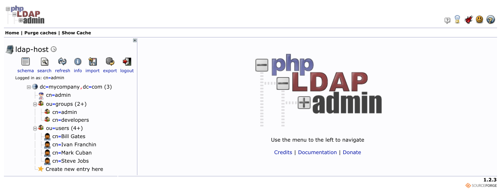

# springboot-keycloak-openldap

## Goal

The goal of this project is to create a simple REST API (`simple-service`) and secure it with [`Keycloak`](https://www.keycloak.org).
Furthermore, `Keycloak`'s users will be loaded from a [`OpenLDAP`](https://www.openldap.org) server.

## Start Environment

***Note. In order to run some commands/scripts, you must have [`jq`](https://stedolan.github.io/jq) installed on you machine***

### Docker Compose

1. Open one terminal

2. Inside `/springboot-keycloak-openldap` root folder run
```
docker-compose up -d
```
> To stop and remove containers, networks, images, and volumes type:
> ```
> docker-compose down -v
> ```

- Wait a little bit until `MySQL` and `Keycloak` containers are `Up (healthy)`
- In order to check the status of the containers run the command
```
docker-compose ps
```

You should see something like
```
Name                   Command                          State          Ports
----------------------------------------------------------------------------------------------------
keycloak               /opt/jboss/docker-entrypoi ...   Up (healthy)   0.0.0.0:8181->8080/tcp
ldap-service           /container/tool/run              Up             0.0.0.0:389->389/tcp, 636/tcp
mysql-keycloak         docker-entrypoint.sh mysqld      Up (healthy)   0.0.0.0:3306->3306/tcp
phpldapadmin-service   /container/tool/run              Up             0.0.0.0:6443->443/tcp, 80/tcp
```

### Configuring OpenLDAP



1. Access the link: https://localhost:6443

2. Login with the credentials
```
Login DN: cn=admin,dc=mycompany,dc=com
Password: admin
```

3. Import the file `/springboot-keycloak-openldap/ldap/ldap-mycompany-com.ldif`

This file has already a pre-defined structure for mycompany.com.
Basically, it has 2 groups (developers and admin) and 4 users (Bill Gates, Steve Jobs, Mark Cuban and Ivan Franchin).
Besides, it is defined that Bill Gates, Steve Jobs and Mark Cuban belong to developers group and Ivan Franchin belongs to admin group.
```
Bill Gates > username: bgates, password: 123
Steve Jobs > username: sjobs, password: 123
Mark Cuban > username: mcuban, password: 123
Ivan Franchin > username: ifranchin, password: 123
```

### Configuring Keycloak


1. Access the link: http://localhost:8181

2. Login with the credentials
```
Username: admin
Password: admin
```

3. Create a new Realm
- Go to top-left corner and hover the mouse over `Master` realm. A blue button `Add realm` will appear. Click on it.
- On `Name` field, write `company-services`. Click on `Create`.

4. Create a new Client
- Click on `Clients` menu on the left.
- Click `Create` button.
- On `Client ID` field type `simple-service`.
- Click on `Save`.
- On `Settings` tab, set the `Access Type` to `confidential`.
- Still on `Settings` tab, set the `Valid Redirect URIs` to `http://localhost:8080/*`.
- Click on `Save`.
- Go to `Credentials` tab. Copy the value on `Secret` field. It will be used on the next steps.
- Go to `Roles` tab.
- Click `Add Role` button.
- On `Role Name` type `user`.
- Click on `Save`.

5. LDAP Integration
- Click on the `User Federation` menu on the left.
- Select `ldap`.
- On `Vendor` field select `Other`
- On `Connection URL` type `ldap://<machine-ip-address OR ldap-service-docker-ip-address>`.

> `machine-ip-address` can be obtained by executing `ifconfig` command on Mac/Linux terminal or `ipconfig` on Windows;
>
> `ldap-service-docker-ip-address` can be obtained running the following command on a terminal:
> ```  
> docker inspect -f '{{range .NetworkSettings.Networks}}{{.IPAddress}}{{end}}' ldap-service
> ```

- On `Users DN` type `ou=users,dc=mycompany,dc=com`
- On `Bind DN` type `cn=admin,dc=mycompany,dc=com`
- On `Bind Credential` set `admin`
- On `Custom User LDAP Filter` set `(gidnumber=500)` to just get developers.
- Click on `Save`.
- Click on `Synchronize all users`.

6. Configure users imported
- Click on `Users` menu on the left.
- Click on `View all users`. 3 users will be shown.
- Edit user `bgates`.
- Go to `Role Mappings` tab.
- Select `simple-service` on the combo-box `Client Roles`.
- Add the role `user` to `bgates`.
- Do the same for the user `sjobs`.
- Let's leave `mcuban` without `user` role.

### Spring Boot Application

1. Go to a terminal

2. In `springboot-keycloak-openldap` root folder, run the command bellow to start `simple-service` application:
```
mvn clean spring-boot:run
```

## Test using cURL

1. Open a new terminal

2. Call the endpoint `GET /api/public` using the cURL command bellow.
```
curl -i http://localhost:8080/api/public
```

It will return:
```
Code: 200
Response Body: It is public.
```

3. Try to call the endpoint `GET /api/private` (without authentication) using the cURL command bellow.
``` 
curl -i http://localhost:8080/api/private
```

It will return:
```
Code: 302
```

Here, the application is trying to redirect the request to an authentication link.

4. Export to `SIMPLE_SERVICE_CLIENT_SECRET` environment variable the _Client Secret_ generated by Keycloak for
`simple-service` (Configuring Keycloak, step 4).
```
export SIMPLE_SERVICE_CLIENT_SECRET=...
```

5. Run the command bellow to get an access token for `bgates` user.
```
BGATES_ACCESS_TOKEN=$(curl -s -X POST \
  "http://localhost:8181/auth/realms/company-services/protocol/openid-connect/token" \
  -H "Content-Type: application/x-www-form-urlencoded" \
  -d "username=bgates" \
  -d "password=123" \
  -d "grant_type=password" \
  -d "client_secret=$SIMPLE_SERVICE_CLIENT_SECRET" \
  -d "client_id=simple-service" | jq -r .access_token)
```

6. Call the endpoint `GET /api/private` using the cURL command bellow.
```
curl -i -H "Authorization: Bearer $BGATES_ACCESS_TOKEN" http://localhost:8080/api/private
```

It will return:
```
Code: 200
Response Body: bgates, it is private.
```

7. Run the command bellow to get an access token for `mcuban` user.
```
MCUBAN_ACCESS_TOKEN=$(curl -s -X POST \
  "http://localhost:8181/auth/realms/company-services/protocol/openid-connect/token" \
  -H "Content-Type: application/x-www-form-urlencoded" \
  -d "username=mcuban" \
  -d "password=123" \
  -d "grant_type=password" \
  -d "client_secret=$SIMPLE_SERVICE_CLIENT_SECRET" \
  -d "client_id=simple-service" | jq -r .access_token )
```

8. Try to call the endpoint `GET /api/private` using the cURL command bellow.
```
curl -i -H "Authorization: Bearer $MCUBAN_ACCESS_TOKEN" http://localhost:8080/api/private
```

As mcuban doesn't have the `user` role, he cannot access this endpoint. The endpoint return will be:
```
Code: 403
Response Body:
{
  "timestamp":1524556466611,
  "status":403,
  "error":"Forbidden",
  "message":"Access is denied",
  "path":"/api/private"
}
```

9. Go to `Keycloak` and add the role `user` to the `mcuban` user.

10. Run the command on `step 7)` again to get a new access token for `mcuban` user.

11. Call again the endpoint `GET /api/private` using the cURL command presented on `step 8`.
It will return:
```
Code: 200
Response Body: mcuban, it is private.
```

## Using client_id and client_secret to get access token

You can get an access token to `simple-service` using `client_id` and `client_secret`

- Go to `Keycloak`.
- Select `company-services` realm (if it is not already selected).
- Click on `Clients` on the left menu.
- Select `simple-service` client.
- On `Settings` tab, turn `ON` the field `Service Accounts Enabled`.
- Click on `Save`.
- On `Service Account Roles` tab.
- Select `simple-service` on the combo-box `Client Roles`.
- Add the role `user`.
- Go to a terminal and run the commands
```
CLIENT_ACCESS_TOKEN=$(curl -s -X POST \
  "http://localhost:8181/auth/realms/company-services/protocol/openid-connect/token" \
  -H "Content-Type: application/x-www-form-urlencoded" \
  -d "grant_type=client_credentials" \
  -d "client_secret=$SIMPLE_SERVICE_CLIENT_SECRET" \
  -d "client_id=simple-service" | jq -r .access_token)
```

- Try to call the endpoint `GET /api/private` using the cURL command bellow.
```
curl -i http://localhost:8080/api/private -H "authorization: Bearer $CLIENT_ACCESS_TOKEN"
```

It will return:
```
Code: 200
Response Body: service-account-simple-service, it is private.
```

## Test using Swagger


1. Access the link: http://localhost:8080/swagger-ui.html

2. Click on `GET /api/public` to open it. Then, click on `Try it out` button and, finally, click on `Execute` button
It will return:
```
Code: 200
Response Body: It is public.
```

3. Now click on `GET /api/private`, it is a secured endpoint. Let's try it without authentication.

4. Click on `Try it out` button and then on `Execute` button
It will return:
```
TypeError: Failed to fetch
```

5. In order to access the private endpoint, you need an access token. To get it, run the following commands in a terminal.
```
BGATES_ACCESS_TOKEN="Bearer $(curl -s -X POST \
  "http://localhost:8181/auth/realms/company-services/protocol/openid-connect/token" \
  -H "Content-Type: application/x-www-form-urlencoded" \
  -d "username=bgates" \
  -d "password=123" \
  -d "grant_type=password" \
  -d "client_secret=$SIMPLE_SERVICE_CLIENT_SECRET" \
  -d "client_id=simple-service" | jq -r .access_token)"
  
echo $BGATES_ACCESS_TOKEN 
```

6. Copy (`Ctr-C`) the token generated (something like that starts with `Bearer ...`) and go back to `Swagger`.

7. Click on the `Authorize` button, paste (`Ctr-V`) the copied access token in the value field. Then, click on `Authorize` and, to finalize, click on `Close`.

8. Go to `GET /api/private`, click on `Try it out` and then on `Execute` button
It will return:
```
Code: 200
Response Body: bgates, it is private.
```

9. The access token default expiration period is `5 minutes`. So, wait for this time and, using the same access token, try to call the private endpoint.
It will return:
```
Code: 401
Response Body:
{
  "timestamp": 1523395954815,
  "status": 401,
  "error": "Unauthorized",
  "message": "Unable to authenticate using the Authorization header",
  "path": "/api/private"
}
```

## Useful Links

### jwt.io

With [jwt.io](https://jwt.io) you can inform the JWT token you have received from Keycloak and the online tool decodes
the token, showing the header and payload of the token.